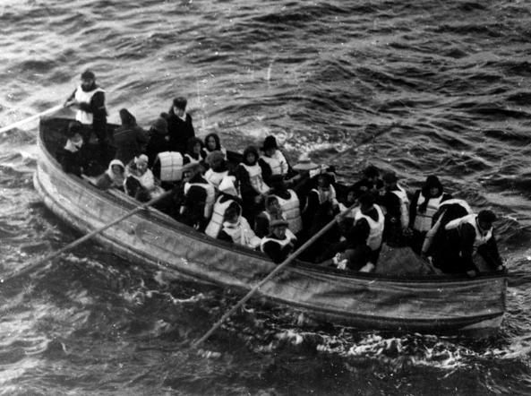
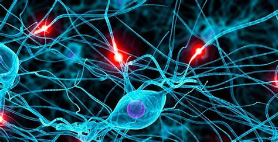
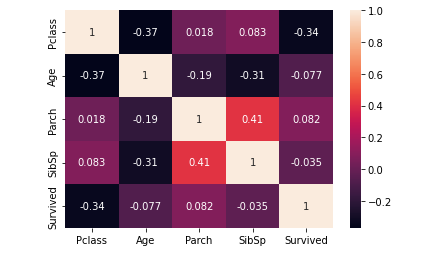
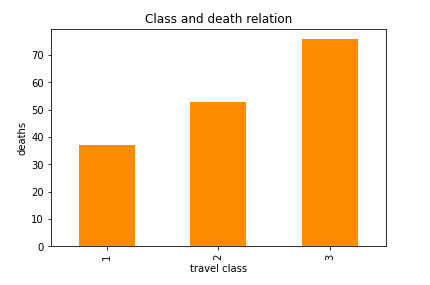
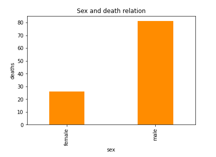
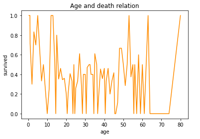

# Titanic Challenge *

<br>

**Qzer - 2022**

<br>
<br>
<br>
<br>
<br>

<b style="color:#ff77c5;">\*</b> Amine, Carlo, Davide, Enrico, Federico, Giulio

---

## Il Titanic

Il **Titanic** è stato un transatlantico britannico naufragato nelle prime ore del 15 aprile 1912, durante il suo viaggio inaugurale, a causa della collisione con un iceberg.


---

## Qualche numero

I passeggeri del Titanic erano teoricamente **2224**, di cui:

- 324 in prima classe;
- 284 in seconda;
- 709 in terza;
- 906 membri dell'equipaggio

---

## Morti

Stando ai numeri ufficiali, nel disastro persero la vita ben 1502, <b style="color:#8ee8fc;">67,54%</b>



---

## Challenge

Costruire un modello predittivo che risponda alla domanda: <b style="color:#8ee8fc;">“che tipo di persone avevano maggiori probabilità di sopravvivere?"</b>

La <b style="color:#8ee8fc;">Titanic Challenge</b> è un esempio classico di problema di classificazione che viene spesso utilizzato per mostrare come funzionano le reti neurali


<!-- Per "addestrare" una rete neurale per risolvere questo problema, dobbiamo fornirle un gran numero di esempi di passeggeri del Titanic etichettati come "sopravvissuti" o "non sopravvissuti". L'algoritmo di apprendimento automatico analizzerà questi dati e cercherà di riconoscere dei pattern o delle regole che possono essere utilizzate per prevedere se un passeggero sopravviverà o no. Ad esempio, potrebbe scoprire che i passeggeri più giovani hanno più probabilità di sopravvivere, o che i passeggeri che viaggiano con un familiare hanno più probabilità di sopravvivere.

Una volta che l'algoritmo ha imparato a prevedere correttamente se un passeggero sopravviverà o no, possiamo testare la sua capacità di prevedere i risultati fornendogli dei nuovi dati di passeggeri del Titanic e vedendo come si comporta. Se la sua precisione non è soddisfacente, possiamo fornirle altri dati di esempio e continuare ad "addestrarla" finché non raggiunge un livello di precisione accettabile. -->

---

## Rete neurale


Le reti neurali si basano principalmente sulla simulazione di neuroni artificiali opportunamente collegati

---

### Funzionamento

Ogni neurone riceve delle informazioni da altri neuroni (gli <b style="color:#8ee8fc;">ingressi</b>), le elabora e le passa a quelli successivi. Ogni neurone ha dei <b style="color:#8ee8fc;">pesi</b> associati agli ingressi, che indicano l'importanza di ogni informazione. Se la somma delle informazioni con i loro pesi supera una certa soglia, il neurone si attiva e invia una risposta (l'<b style="color:#8ee8fc;">uscita</b>)


---

### Rete neurale multistrato

Composta da tre o più strati di neuroni.

Il primo strato è solitamente chiamato <b style="color:#8ee8fc;">strato di ingresso</b> e si occupa di ricevere gli input.

Gli input vengono elaborati dai neuroni del primo strato e inviati al secondo strato, chiamato <b style="color:#8ee8fc;">strato nascosto</b>.

Il secondo strato elabora ulteriormente gli input e li invia al terzo strato, chiamato <b style="color:#8ee8fc;">strato di uscita</b>.



---

## Dati

<!-- 
Una volta che l'algoritmo ha imparato a prevedere correttamente se un passeggero sopravviverà o no, possiamo testare la sua capacità di prevedere i risultati fornendogli dei nuovi dati di passeggeri del Titanic e vedendo come si comporta. Se la sua precisione non è soddisfacente, possiamo fornirle altri dati di esempio e continuare ad "addestrarla" finché non raggiunge un livello di precisione accettabile. -->

In questa competizione avremo accesso a due set di dati simili che includono informazioni sui passeggeri come:

- nome;
- età;
- genere;
- classe socio-economica;
- ecc.


---

## Train.csv

`Train.csv` conterrà i dettagli di un sottoinsieme dei passeggeri a bordo (891 per l'esattezza) e, soprattutto, conterrà l'informazione relativa al loro destino

---

```python
training_set = pd.read_csv('/kaggle/input/titanic/train.csv')
training_set.info()

RangeIndex: 891 entries, 0 to 890        
 #   Column       Non-Null Count  Dtype  
 #   ------       --------------  -----  
 0   PassengerId  891 non-null    int64  
 1   Survived     891 non-null    int64
 2   Pclass       891 non-null    int64  
 3   Name         891 non-null    object 
 4   Sex          891 non-null    object 
 5   Age          714 non-null    float64
 6   SibSp        891 non-null    int64  
 7   Parch        891 non-null    int64  
 8   Ticket       891 non-null    object 
 9   Fare         891 non-null    float64
 10  Cabin        204 non-null    object 
```

---

## Test.csv

Il file `test.csv` contiene informazioni su altri 418 passeggeri, non rivelando la loro sorte.

Il compito della challenge è, utilizzando i dati  del file `train.csv`, prevedere se questi 418 passeggeri a bordo sopravviveranno

---

```python
testing_set = pd.read_csv('/kaggle/input/titanic/test.csv')
testing_set.info()

RangeIndex: 418 entries, 0 to 417      
 #   Column       Non-Null Count  Dtype  
 #   ------       --------------  -----  
 0   PassengerId  418 non-null    int64  
 1   Pclass       418 non-null    int64  
 2   Name         418 non-null    object 
 3   Sex          418 non-null    object 
 4   Age          332 non-null    float64
 5   SibSp        418 non-null    int64  
 6   Parch        418 non-null    int64  
 7   Ticket       418 non-null    object 
 8   Fare         417 non-null    float64
 9   Cabin        91 non-null     object 
 10  Embarked     418 non-null    object 
```

---

## Data selection

Alcune colonne non sono utili per raggiungere il nostro obiettivo.
Il primo passo consiste quindi nel <b style="color:#8ee8fc;">selezionare le colonne</b> coi dati che, ipoteticamente, possono avere un'influenza sulla sopravvivenza di un passeggero

---

Queste le colonne trattenute dal file `train.csv`

```pandas
RangeIndex: 891 entries, 0 to 890        <--
 #   Column       Non-Null Count  Dtype  
---  ------       --------------  -----  
 0   PassengerId  891 non-null    int64  
 1   Pclass       891 non-null    int64  
 2   Sex          891 non-null    object 
 3   Age          714 non-null    float64
 4   Parch        891 non-null    int64  
 5   SibSp        891 non-null    int64  
 6   Survived     891 non-null    int64  
```

---

## Correlazioni

```python
import seaborn as sns

ax = sns.heatmap(clean_training_set.corr(), annot=True)
```



---

### Classe di viaggio

La morte dei passeggeri sembra essere altamente correlata alla loro classe

```python
class_scheme = clean_training_set.groupby('Pclass')['Survived'].apply(lambda x: (x==0).mean())
class_scheme.plot(kind='bar', color='darkorange', width = 0.5, title='Class and death relation', ylabel='deaths', xlabel='travel class')
```



---

### Sesso

Come si può notare, il tasso di mortalità dei maschi è maggiore di quello delle femmine

```python
sex_scheme = clean_training_set.groupby('Sex')['Survived'].apply(lambda x: (x==0).mean())
sex_scheme.plot(kind='bar', color='darkorange', width = 0.4, title='Sex and death relation', ylabel='deaths', xlabel='sex')
```



---

### Età

I bambini e gli anziani sul Titanic morirono meno delle persone di mezza età (probabilmente perché avevano la priorità)

```python
age_scheme = clean_training_set.groupby('Age')['Survived'].mean()
age_scheme.plot(kind='line', color='darkorange', title='Age and death relation', ylabel='survived', xlabel='age')
```



---

### Matrimonio

Il numero di figli sembra essere un fattore di probabilità di morte

```python
parch_scheme = clean_training_set.groupby('Parch')['Survived'].apply(lambda x: (x==0).mean())
parch_scheme.plot(kind='bar', color='darkorange', width = 0.8, title='SibSp and death relation', ylabel='deaths', xlabel='Parch')
```


---

## Algoritmo

[Multi-layer Perceptron classifier (MLP)](https://scikit-learn.org/stable/modules/generated/sklearn.neural_network.MLPClassifier.html)

<!-- Una rete neurale multistrato (o "rete neurale a più strati") è un tipo di rete neurale composta da tre o più strati di neuroni.

Il primo strato è solitamente chiamato strato di ingresso e si occupa di ricevere gli input (ad esempio, i pixel di un'immagine). Gli input vengono elaborati dai neuroni del primo strato e inviati al secondo strato, chiamato strato nascosto. Il secondo strato elabora ulteriormente gli input e li invia al terzo strato, chiamato strato di uscita. Il terzo strato produce l'output finale della rete neurale, che può essere, ad esempio, una classificazione o una previsione. -->

<!-- - L'algoritmo riceve in input un set di dati di addestramento, ognuno dei quali consiste in una serie di input e l'output desiderato;

- Il set di dati viene utilizzato per "allenare" la rete neurale, ovvero per modificare i pesi delle connessioni tra i neuroni in modo che la rete neurale produca l'output corretto per ogni input.

- L'algoritmo utilizza una funzione di perdita (ad esempio, l'errore quadratico medio) per misurare quanto l'output della rete neurale differisce dall'output desiderato.

- L'algoritmo utilizza l'algoritmo di backpropagation per modificare i pesi delle connessioni tra i neuroni in modo da ridurre l'errore. Questo viene fatto ripetutamente, utilizzando sempre più dati di addestramento, finché l'errore non raggiunge un livello accettabile. -->

L'algoritmo <b style="color:#8ee8fc;">MLP</b> è un metodo per addestrare le reti neurali multistrato. Consiste nel modificare i pesi delle connessioni tra i neuroni della rete neurale in modo da ridurre l'errore tra l'output della rete neurale e l'output desiderato. L'algoritmo viene ripetuto finché l'errore non raggiunge un livello accettabile.

---

### MLP

Dopo aver normalizzato il DataSet

```python

from sklearn.neural_network import MLPClassifier
from sklearn.datasets import make_classification
from sklearn.model_selection import train_test_split

X, Y = make_classification(n_samples=100, random_state=1)
X_train, X_test, y_train, y_test = train_test_split(X, Y, test_size=0.2,random_state=1)

clf = MLPClassifier(solver='lbfgs', learning_rate='constant', activation='relu', random_state=1, max_iter=800).fit(X_train, y_train)

MLP_score = clf.score(X_test, y_test)
print('L\'accuratezza dell\'algoritmo Multi-layer Perceptron classifier è',round(MLP_score*100,2))

```

L'accuratezza è del <b style="color:#8ee8fc;">90.0</b>

---

## Github

Per maggiori informazioni

[TitanicKaggle](https://github.com/Fedege98/TitanicKaggle/blob/Data-selection/titanicchallenge.ipynb)


---

## Tecnologie utilizzate

- VSCode
- Git
- Markdown, Marp e CSS3
- Python
- Pandas
- Jupyter Notebook

---

## Bibliografia

[Titanic - Wikipedia](https://it.wikipedia.org/wiki/RMS_Titanic)
[Passeggeri del Titanic - Wikipedia](https://it.wikipedia.org/wiki/Passeggeri_del_RMS_Titanic#Sopravvissuti_e_morti_per_nazionalit%C3%A0)
[Titanic Challenge - Kaggle](https://www.kaggle.com/competitions/titanic)

---


<h1 style="display: flex; align-items: center; justify-content: center;width: 100%; height: 70%">Grazie</h1>